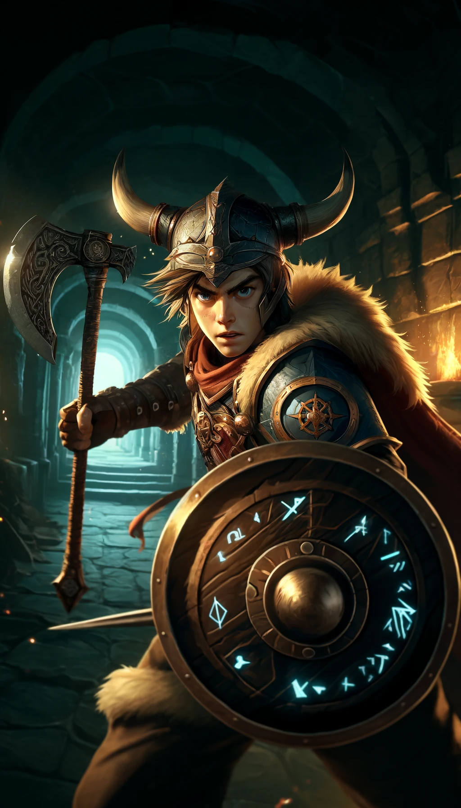
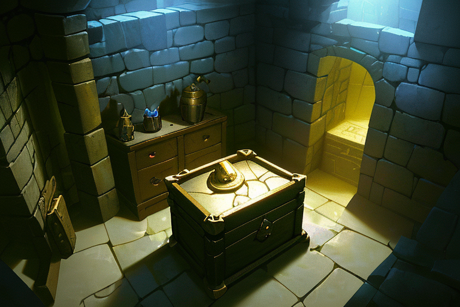
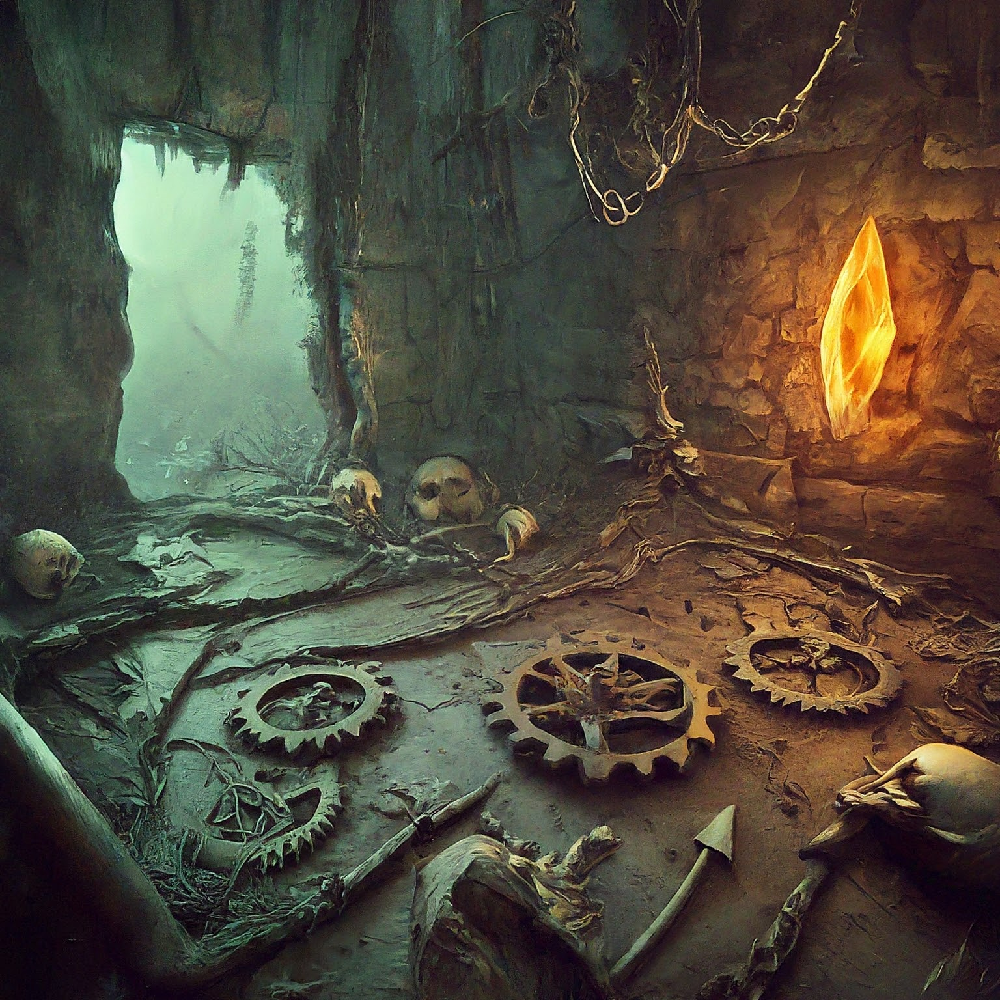

# Dungeon Explorer

A small dungeon crawling prototype built with React. Navigate rooms, avoid traps and collect treasure.

## How to Play
1. Use the arrow buttons in the on-screen controller to move Bjorn around the 7×7 grid.
2. When you step into a room with a chest, click the chest to roll dice and try to open it.
3. Trap rooms require a successful dice roll to disarm. Failing will damage your hero.
4. Fight goblins that appear and gather loot to improve your gear.
5. Explore as many rooms as you can and try to survive the dungeon!

### Screenshots

## Available Scripts

The project uses the standard Create React App scripts:

### `npm start`
Runs the app in development mode at [http://localhost:3000](http://localhost:3000).

### `npm test`
Launches the interactive test runner.

### `npm run build`
Creates a production build in the `build` folder.

### `npm run eject`
Copies configuration files so you can customize the build (this cannot be undone).

